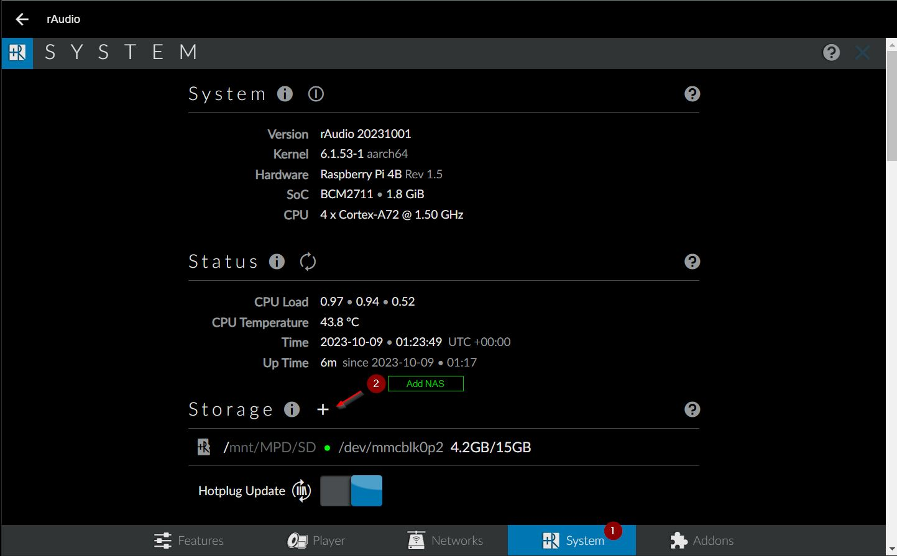
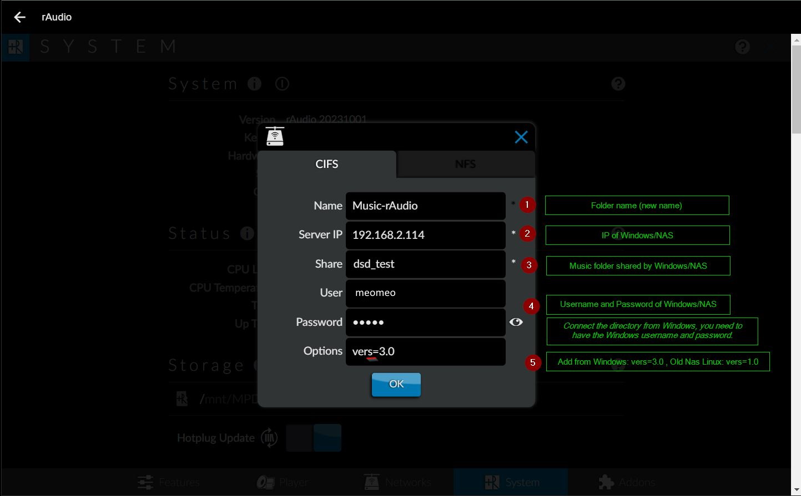
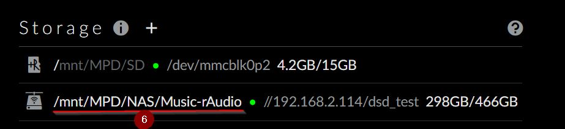
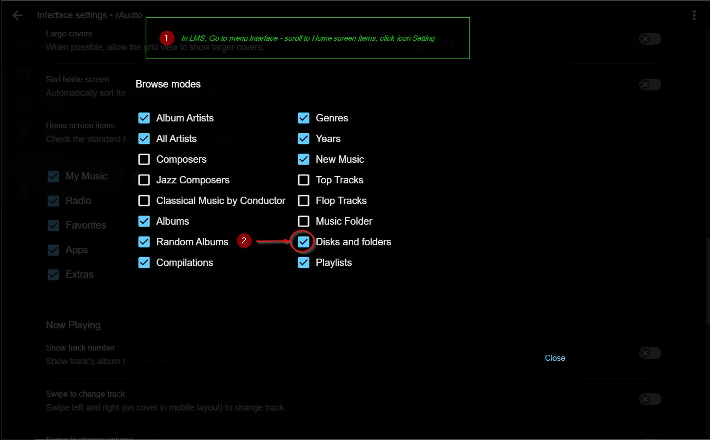
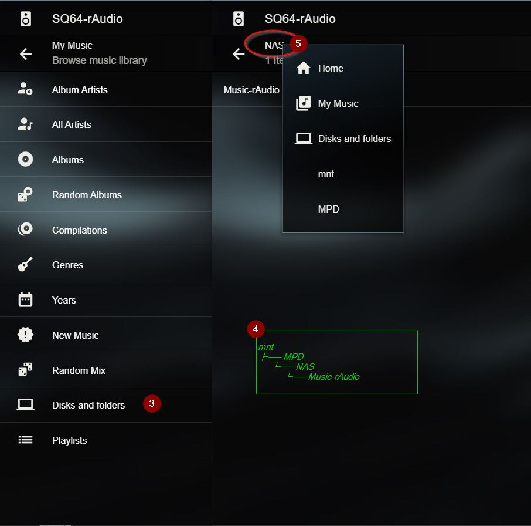
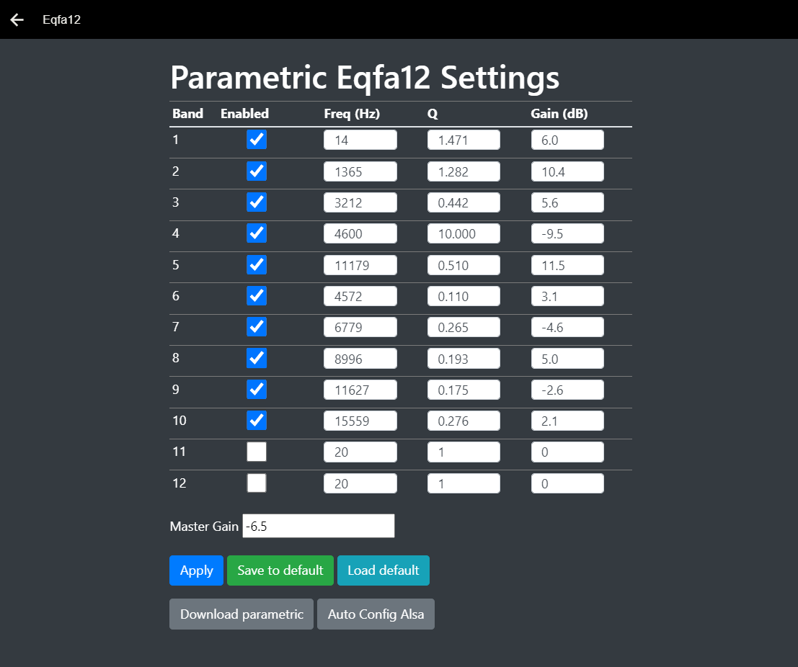
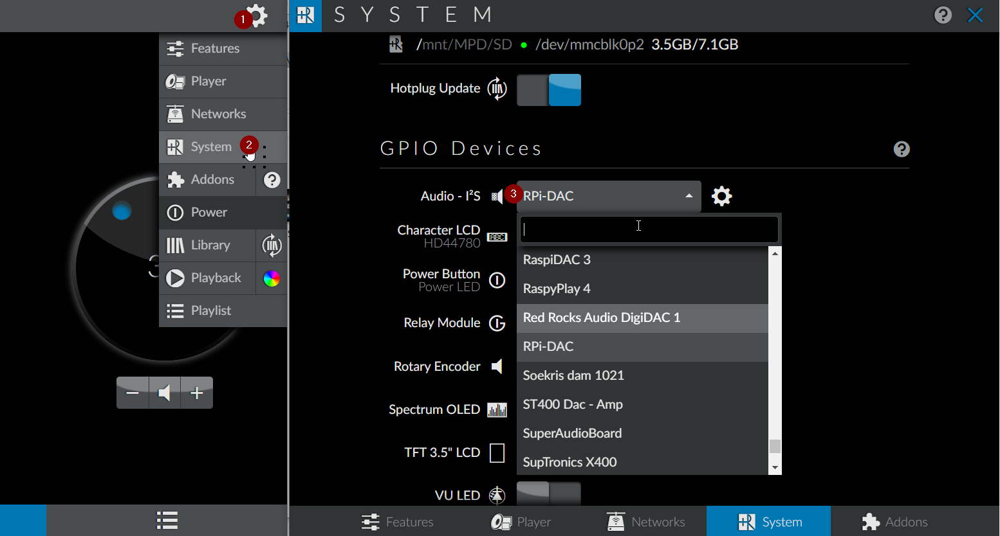
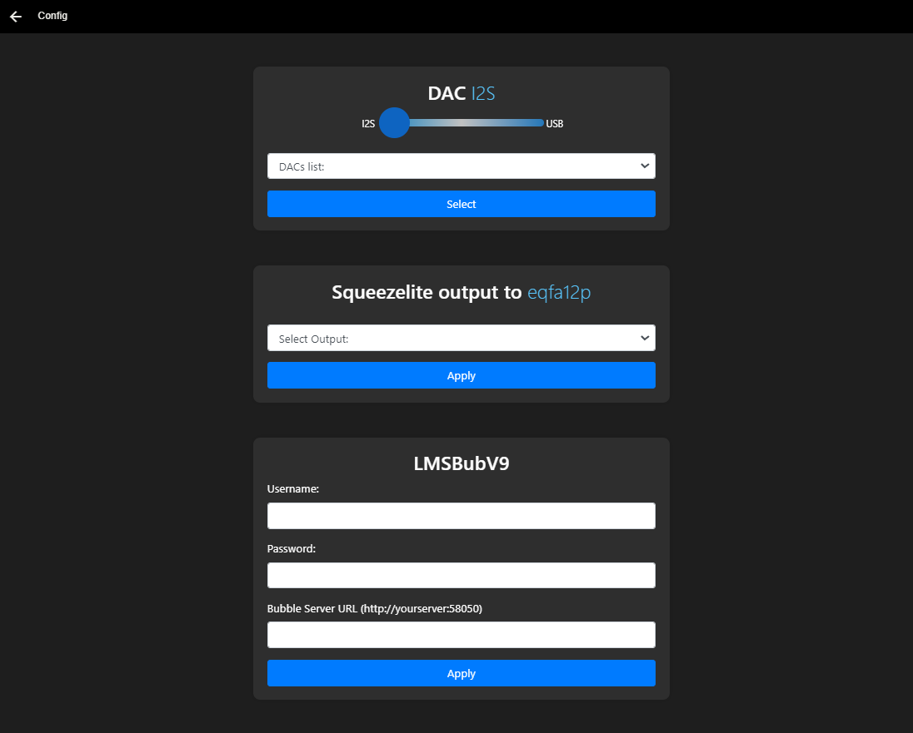
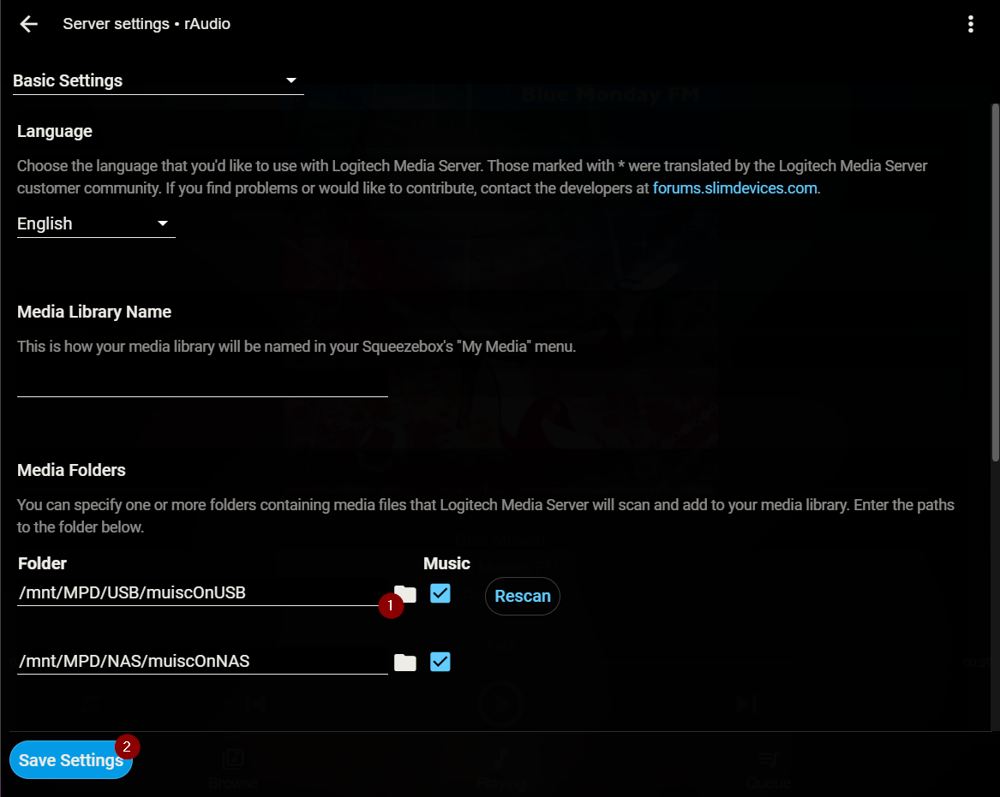
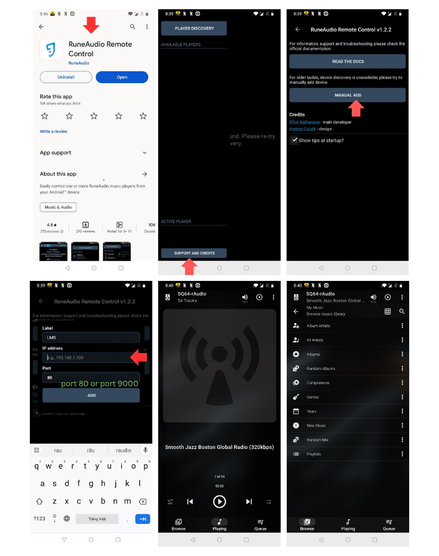

# Tips for using rAudio and LMS
### #1 Add NAS to rAudio

>
--------
>
#### Listen to music from your NAS (or PC) with LMS on rAudio.
>
In LMS, click the Interface menu, scroll to Home screen items, click the Settings icon, click Disks and Folders.
>

>

>
-------
>
### #2 Install htop 64 bit
>
> cd /tmp && wget http://ftp.tku.edu.tw/Linux/ArchLinux-arm/aarch64/extra/htop-3.2.2-1-aarch64.pkg.tar.xz
>
> pacman -U htop-3.2.2-1-aarch64.pkg.tar.xz
>
-----------------
### #3 NFS IP in fstab
>
> wget -O - https://raw.githubusercontent.com/lovehifi/addraudio/main/mountnfs | sh
>
-----------------
### #4 Eqfa12 LMS 
>
>
> wget -O - https://raw.githubusercontent.com/lovehifi/addraudio/main/eqfa12lms | sh
>

>
https://github.com/lovehifi/eqfa12
>
-----------------
### #5 Config GUI LMS

> wget -O - https://raw.githubusercontent.com/lovehifi/addraudio/main/configgui | sh
>
Select the Audio I2S device if you are using an I2S DAC for the first time.
>

>
Next, from the LMS - Config menu, you can easily switch between I2S DAC and USB DAC by dragging the circle. If you have multiple different USB DACs, you can also easily switch between them in the DACs list.

>
-----------------
### #6 Plugin LMS
Some plugins in the LMS are not too necessary; you can deactivate them to make your system run smoother. Additionally, there are plugins that can conversion of your audio files, such as SqueezeDSP. I advise you not to activate it unless necessary.

Here are the plugins that I have activated:

- Additional Browse Modes
- Advanced Tag View
- Deezer
- Don't Stop The Music
- Material Skin
- mysqueezebox.com services handler
- Radio
- Random Mix
- Remote Music Libraries
-	Save Playlist
- Spotify for Squeezebox
- Tidal
- Qobuz
- YouTube
---------------------
### #7 Set up your music library in LMS.

-----------
## App Control LMSrAudio

>
-----------------------
>
## Build LMS-rAudio for Pi 2, Pi 3 and Pi 4
>
How to create a perfect and feature-rich Music Server-Player with a user-friendly, easy-to-use, and visually appealing interface, coupled with outstanding sound quality on your Raspberry Pi? Choose rAudio on the Arch Linux platform to turn this into a reality. (Pi 2, Pi 3, and Pi 4).
>
https://github.com/lovehifi/build-lms-sq-raudio
>
----------------
## Why rAudio‐LMS?
https://github.com/lovehifi/raudiolms-32bit/wiki/Why-rAudio%E2%80%90LMS%3F
