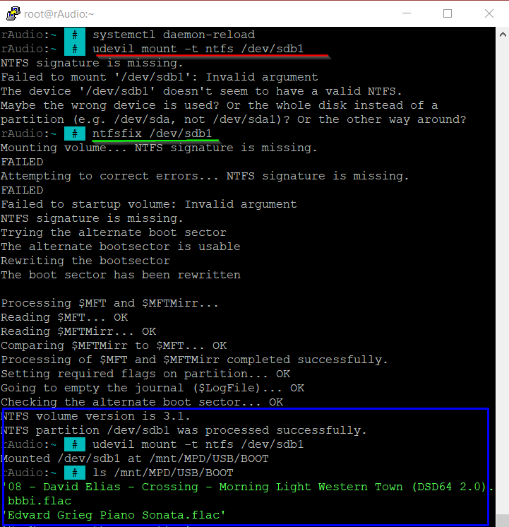

# Tips for using rAudio and LMS
### #1 Add NAS to rAudio


>
--------
>
#### Listen to music from your NAS (or PC) with LMS on rAudio.
>
In LMS, click the Interface menu, scroll to Home screen items, click the Settings icon, click Disks and Folders.
>

>


>
-------
>
### #2 Install htop 64 bit
>
> cd /tmp && wget http://ftp.tku.edu.tw/Linux/ArchLinux-arm/aarch64/extra/htop-3.2.2-1-aarch64.pkg.tar.xz
>
> pacman -U htop-3.2.2-1-aarch64.pkg.tar.xz
>
-----------------
### #3 NFS IP in fstab
>
> wget -O - https://raw.githubusercontent.com/lovehifi/addraudio/main/mountnfs | sh
>
-----------------
### #4 Eqfa12 LMS 
>
>
> wget -O - https://raw.githubusercontent.com/lovehifi/addraudio/main/eqfa12lms | sh
>

>
https://github.com/lovehifi/eqfa12
>
-----------------
### #5 Config GUI LMS

> wget -O - https://raw.githubusercontent.com/lovehifi/addraudio/main/configgui | sh
>
Select the Audio I2S device if you are using an I2S DAC for the first time.
>

>
Next, from the LMS - Config menu, you can easily switch between I2S DAC and USB DAC by dragging the circle. If you have multiple different USB DACs, you can also easily switch between them in the DACs list.

>
-----------------
### #6 Plugin LMS
Some plugins in the LMS are not too necessary; you can deactivate them to make your system run smoother. Additionally, there are plugins that can conversion of your audio files, such as SqueezeDSP. I advise you not to activate it unless necessary.

Here are the plugins that I have activated:

- Additional Browse Modes
- Advanced Tag View
- Deezer
- Don't Stop The Music
- Material Skin
- mysqueezebox.com services handler
- Radio
- Random Mix
- Remote Music Libraries
-	Save Playlist
- Spotify for Squeezebox
- Tidal
- Qobuz
- YouTube
---------------------
### #7 Set up your music library in LMS.


-----------
### #8 App Control for LMSrAudio

>
----------
### #9 Play on USB HDD
>
Initial configuration to listen to music directly (No need to scan) from USB (only needs to be done once). Next time, click on 'Disk and Folder' on the homepage to access USB/NAS.
>

>

-----------------------
### #10 Fixing NTFS Error to Mount USB HDD on rAudio

At times, you might encounter a situation where you want to mount your USB HDD device on rAudio, but it doesn't seem to work, and your USB device is not found in /mnt/MPD/USB/. Here's how you can potentially fix the NTFS error and make the USB HDD mount successfully.

First, open the Putty SSH terminal and run the following command to install the ntfs-3g package:
```bash
pacman -S ntfs-3g
```
Use the
```bash
 fdisk -l 
```
>
command to view the list of USB devices. For example, if your USB HDD device is labeled as /dev/sdb1, you can follow these steps:

To ensure that the device is not currently mounted, execute the command:
```bash
udevil umount /dev/sdb1
```
Run the ntfsfix command to attempt to fix errors on the USB device:
```bash
ntfsfix /dev/sdb1
```
Finally, use the udevil command to remount the device with the NTFS option:
```bash
udevil mount -t ntfs /dev/sdb1
```
>
I did this to successfully mount my NTFS HDD.
>


>
----------------------

## Build LMS-rAudio for Pi 2, Pi 3 and Pi 4
>
How to create a perfect and feature-rich Music Server-Player with a user-friendly, easy-to-use, and visually appealing interface, coupled with outstanding sound quality on your Raspberry Pi? Choose rAudio on the Arch Linux platform to turn this into a reality. (Pi 2, Pi 3, and Pi 4).
>
https://github.com/lovehifi/build-lms-sq-raudio
>
----------------
## Why rAudio‐LMS?
https://github.com/lovehifi/raudiolms-32bit/wiki/Why-rAudio%E2%80%90LMS%3F
